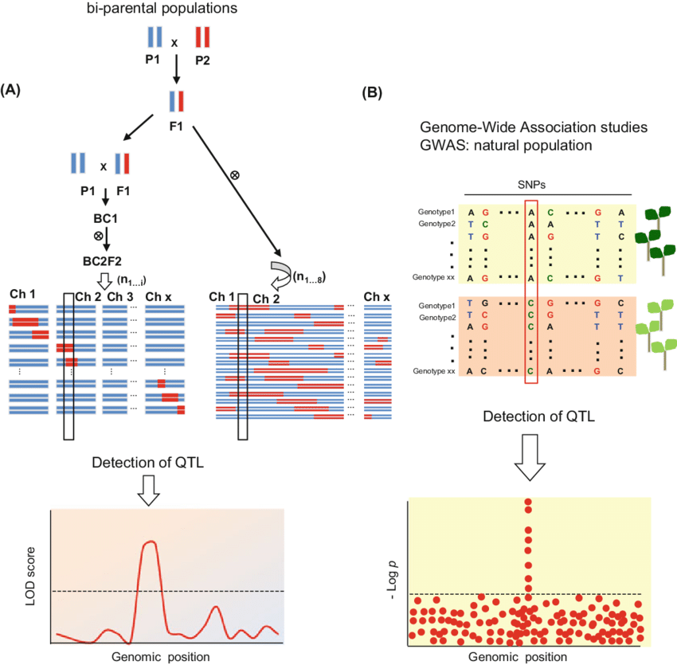

# Quantitative Trait Locus Analysis

This project is about Quantitative Trait Locus Analysis. A method to find locus (section of DNA) that correlates with variation of a quantitative trait in the phenotype of population of organisms. We'll use **Hot peppers** (*Capsicum annuum*) as a focus implementation of QTL Mapping. The idea is to find the gene location that correlated to resistances againts *Phytophora capsici* viruses that cause the plants to become rotten. 

## QTL Analysis - Concept

[Source](https://www.researchgate.net/publication/325123954_Guidelines_for_Sample_Normalization_to_Minimize_Batch_Variation_for_Large-Scale_Metabolic_Profiling_of_Plant_Natural_Genetic_Variance)

## Content Syllabus

* Molecular Marker
  * Marker-Assested Selection
  * Single Nucleotide Polymorphisms (SNPs)
* Quantitative Trait Locus
  * Introduction to QTL analysis
  * Genetic Linkage Map
  * identify data quality
    * Segregation analysis using *Chi-Square*
    * Missing information Genotype
  * Phylogenetic Tree
* Modelling QTL using **qtl** packages R
  * Marker Regression
  * Interval Mapping
    * Standard Interval Mapping
    * Haley-Knott Regression
    * Multiple Imputatuin